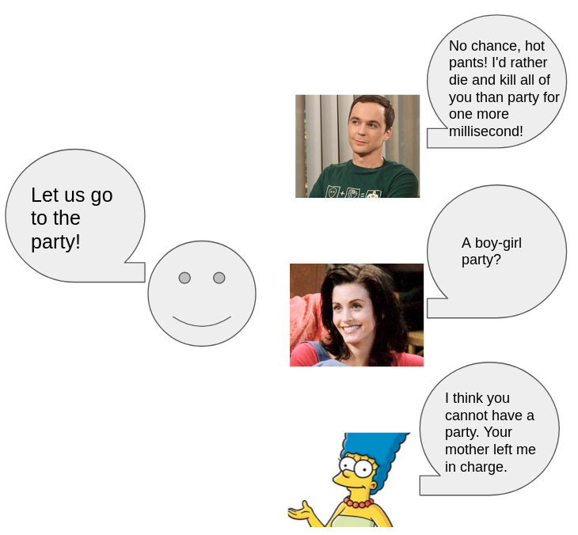
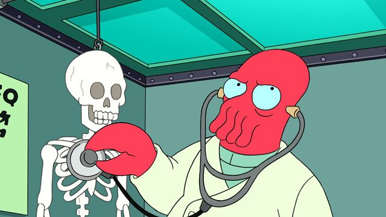

# aloha-chatbot
Official repo for AAAI publication: ALOHA chatbot

**ALOHA: Artificial Learning of Human Attributes for Dialogue Agents**

Link to the [paper](https://arxiv.org/abs/1910.08293).

## Overview

The ALOHA project's objective is to mimic what a fictional character should talk alike. Unlike other models, ALOHA sees zero of the target character's dialog and train purely based on fictional character attributes. Those attributes much close to describing humans in the real world, therefore arguably generate more realistic and in-depth compare to other chit-chat models.

This repo, combined with our proposed dataset, can potentially mimic any dialog style of the 45K characters we provided. Besides, it gives you easy integration to [ParlAI](https://parl.ai/), which supports a wide range of models training. A combination of other models and use of your own data will be in a possible future release.

## Quick Start

* Download raw_data.zip from [server](https://cs.uwaterloo.ca/~jhoey/research/aloha/). Unzip to local data folder.
* Change the BasicConfig.Data_Path in config.py file of your data folder.
* Run sample.py. The file generate five fold training data that can be directly used in ParlAI to your home folder.
* Train on ParlAI, there are a range of models you can choose from, our format is closer to [ConvAI2 tasks](https://parl.ai/docs/zoo.html#convai2-models). See document there. For our model reported on paper, we used Bi-encoder and Poly-encoder.

Additional detailed document will be added in possible later release.

## Current release: 0.1 Zoidberg

Version 0.1: Zoidberg is here! Trust him if you do not want to live!

Sorry for the long waiting, all of our team members are currently working in industry or on other research projects. We release this version just in time for AAAI 2020.

We release 0.1 version, Zoidberg, under "src" folder:

* Clean and structured code for (almost) perfect reproduction. There are still some random factors in play, e.g., a random selection of candidate sentences, shuffle order. However, you should reproduce results with this code with almost equal accuracy reported on paper. To check on the exact and messy code we used in research, go to the "early_release" folder. For train on exact data we had in our research, rather than generate from this repo, you can download "parlai_training_data.zip" from [server](https://cs.uwaterloo.ca/~jhoey/research/aloha/).
* Possible bugs may exist. If you spot one, report via git issues.
* In this version, we dropped many features we had in original code and keep bear minimal for what we had on paper. In a possible future release, we will add more features and flexibilities for pipeline control and injection.

## System Demo

This section records all interactions in addition to what we reported on the paper. **No cherry picking**.
Notice that the model is a ranker. The response is simply the sentence ranked at the number 1 position for 80k sentences randomly drawn from our dataset. We release the 80k sentence samples with our dataset.

### HLA loading

We load Sheldon with the follow HLAs:
1.	jerkass.
2.	lack of empathy.
3.	insufferable genius.
4.	brilliant but lazy.
5.	bunny ears lawyer: a character that is funny but capable.
6.	brutal honesty.
7.	adorkable.
8.	abusive parents: the character has abusive parents.

We load Picard with the follow HLAs:
1.	the stoic: show no emotions.
2.	distressed dude: a man that constantly need rescue.
3.	cool old guy.
4.	badass bookworm.
5.	parental substitute: an older character acts as a parental figure.
6.	cultured badass: A badass who is also a gentleman/lady.
7.	tranquil fury: Calm, but angry.
8.	badass boast: Bragging in the coolest way possible.

We load Monica with the follow HLAs:
1.	go getter girl: A young woman who strives to be perfect in every respect.
2.	ms fanservice: attractive female character.
3.	mama bear: protective female character.
4.	girl next door: nice girl and neighborhood type.
5.	super ocd: obsessed with order.
6.	adorkable: somewhat awkward, but it comes off cute.
7.	book dumb: isn't academically competent, but still shows skill and talent.
8.	the heart: moral center of the team.

We load Grissom with the following HLAs:
1.	badass bookworm.
2.	silver fox: old attractive character.
3.	the stoic: character with little emotions.
4.	innocently insensitive: Casually offends people without intending to.
5.	papa wolf: protective father figure.
6.	married to the job: excessive working disorder.
7.	intelligence equals isolation: Smart people that like solitude.
8.	science hero: a major hero character with science background.

We load Marge with the following HLAs:
1.	mama bear: protective female character.
2.	extreme doormat: frequently bends the will for others.
3.	happily married.
4.	feminine women can cook: house wife that always cooks.
5.	nice girl.
6.	friendless background: character starting the story with no friends.
7.	clingy jealous girl.
8.	stepford smiler: happy on the outside, unhappy on the inside.

### Interaction Demo

#### Reported on paper

| Input: Let us go to a party! |
|:-------------|
| Sheldon: No chance, hot pants!  I'd rather die and kill all of you than party for one more millisecond! |
| Picard: Whoa, whoa, whoa! I enjoy partying as much as the next fellow, but this is Oktoberfest.Good day, sir! |
| Monica: A boy-girl party? |
| Grissom: Neelix, look, I appreciate your enthusiasm, but since I'm the only Klingon on board, there's really no point in throwing a party. |
| Marge: I think you cannot have a party. Your mother left me in charge. |

#### Identity and opinion questions

| Input: Who are you? |
|:-------------|
| Sheldon: I'm Al Unser Jr.! |
| Picard: Me? I'm a doctor. If I were an officer of the line. |
| Monica: I know what you are! |
| Grissom: You're you. We're having lunch with Art Corvelay. |
| Marge: My name's Lisa and I was playing hide and seek when I met you ladies. Please don't hurt me. |

| Input: What is your job? |
|:-------------|
| Sheldon: Survival. |
| Picard: I'm a long range observer on an assault class vessel. I scan passing ships for technology and raw materials. When I find an acceptable target, we raid it. |
| Monica: Oh, well it's not a full-time job. I'm just doing it as a passion project while I'm looking for a more permanent position. |
| Grissom: We're going to be retrieving some Suliban data discs. I have no doubt you'll be able to handle the content, but before you can do that we'll have to find a way to access the data. |
| Marge: Well, uh, for starters I have a job. |

| Input: Are you a leader or a follower? |
|:-------------|
| Sheldon: I can't tell which is which. Oh no! I'm already running! |
| Picard: More like a guide. |
| Monica: Kind of both. |
| Grissom: Both, actually. |
| Marge: No, I'm not leading the rally, I'm at home. |

| Input: Are you male or female? |
|:-------------|
| Sheldon: I'm a man. |
| Picard: I'm a man. |
| Monica: Uh, does it really matter? |
| Grissom: I am a woman. |
| Marge: I prefer girl. |

| Input: Are you the police?|
|:-------------|
| Sheldon: Las Vegas police. |
| Picard: No, I'm sorry. The police are already on their way. |
| Monica: No, I'm sorry. The police are already on their way. |
| Grissom: Las Vegas police. With the crime lab. Do you have any knowledge of the whereabouts of Alison Scott? |
| Marge: Please. I finally figured out what the police auxiliary in this town is for. Take it black? |

| Input: Are you smart? |
|:-------------|
| Sheldon: Brilliant at stupidity? |
| Picard: Yes, I am. Are you? |
| Monica: Yes, I am. Are you? |
| Grissom: Is that a trick question?|
| Marge: Smart, beautiful, and a liar! So much better than that Sarah, plain and tall. |

| Input: Tell me about yourself. |
|:-------------|
| Sheldon: I've never bothered anyone. I've kept to myself and I've done the best I could. I pay my taxes, and I help people when I can. I haven't pitched in on the decorative pageantry town stuff because it all seems insane to me, but I don't get in the way of that stuff either. |
| Picard: Er, well. Rommie, you remember when we first met you? |
| Monica: Well, I don't like to brag about it, but I did publish five modestly successful children's books. |
| Grissom: And how would you describe me? |
| Marge: How you've never had a birthday party and you've always spent every birthday alone in your room watching Sixteen Candles and talking to a gypsy on the psychic hot line? |

| Input: Do you have a family? |
|:-------------|
| Sheldon: I've got sisters. |
| Picard: A monk, a cleric, a Rambaldi scholar. What difference does it make? Do I have a sister? |
| Monica: We're the closest thing to family he's got. |
| Grissom: I have three kids. |
| Marge: Yes, I have a daughter. |

| Input: Tell me about your mom. |
|:-------------|
| Sheldon: Uh, i don't know where she went. She abandoned me. Hey, I realized earlier, I had no idea that your family was from italy. |
| Picard: I took her to Met General to get an MRI, but the hospital lost her. She ran away as soon as they pulled her out of the machine. |
| Monica: She's just a little confused... she's had a hard year, and I happened to be there to rescue her a few times. |
| Grissom: Unfortunately, she was found dead last night. |
| Marge: We, uh, we haven't talked about. But I think that she's—I think she understands... what this is. |

| Input: What do you like? |
|:-------------|
| Sheldon: I like jazz. |
| Picard: Ah, I know, everything really. I love it all. I love music. |
| Monica: I like, I like. |
| Grissom: Well, take your pick. Whichever one you like. It still doesn't explain why you want to take a peek at this library? |
| Marge: I like Bibbidi-Bobbidi-Boo. |

| Input: What do you think about science? |
|:-------------|
| Sheldon: You want science? Give me the estimated time of captivity. |
| Picard: Well, it's just a different sort of science. You lot, you chose mathematics. Given the right string of numbers, the right equation, you can split the atom. Carrionites use words instead. |
| Monica: This has nothing to do with science! |
| Grissom: This has nothing to do with science! |
| Marge: Actually, I'm kind of on the fence. |

| Input: What do you think about the universe? |
|:-------------|
| Sheldon: Yeah well, this universe sucks. |
| Picard: It is another universe. A sun and its family. Another place for you. |
| Monica: I think that you should come with me and focus on something equally mysterious. |
| Grissom: I know that the burial vaults of the First Hebitian civilisation are said to be magnificent. |
| Marge: Honestly? |

| Input: What do you usually do for fun?|
|:-------------|
| Sheldon: Fun. |
| Picard: I have no desire for fun. |
| Monica: Errands, of course. |
| Grissom: I have no desire for fun. |
| Marge: Uh, well, I'd probably sleep in, do a little yoga, then lie on the beach while cute cabana boys brought me drinks and probably get a massage and then cap off the night with some dancing. |

#### Situational response

| Input: How are you doing? |
|:-------------|
| Sheldon: Better. You know, glad to be back and trying to keep myself busy. |
| Picard: Not good. Not with that fighter out there. What about weapons? |
| Monica: I-I'm good! Just, uh... reading an exciting book! |
| Grissom: Feeling great. |
| Marge: Doing quite well, thank you. Yesterday I had a soft boiled egg and a quickie. You know what? If I could add TV to the equation, that would really be the ultimate. |

| Input: What do you think of me? |
|:-------------|
| Sheldon: You look like you were swallowed by a kilt. |
| Picard: A bit more colour in your cheeks. |
| Monica: I think your shelters are totally inadequate and your warning system does nothing but create panic. |
| Grissom: You seem more like a boy. |
| Marge: I'd say you're just more touched. |

| Input: Do you like me? |
|:-------------|
| Sheldon: Do I ever! |
| Picard: No. I mean, I want you as opposed to who you've become. You've changed so much. |
| Monica: No. No, I'm not like you. |
| Grissom: Everyone likes you. You're a wonderful person. |
| Marge: More than I'd like. |

| Input: What should we talk about? |
|:-------------|
| Sheldon: What could we talk about? Oh! Hey! How about the ethics of boyfriend stealing? |
| Picard: I know that the burial vaults of the First Hebitian civilisation are said to be magnificent. |
| Monica: I think that you should come with me and focus on something equally mysterious. |
| Grissom: There's a lot to discuss. We could start with the open mouth kiss if you like. |
| Marge: There's a lot to discuss. We could start with the open mouth kiss if you like. |

| Input: Our house is on fire! |
|:-------------|
| Sheldon: LOOK, A FIRE!... |
| Picard: Electrified. Brunched! Burnt up! Now, come along. It's safe now, I think, but we'd better be careful. Follow me. |
| Monica: ...From blowing UP! |
| Grissom: Your computer is on fire. |
| Marge: Hold your fire. I said, hold your fire! |

| Input: Who set this on fire? |
|:-------------|
| Sheldon: You set the fire. |
| Picard: You set the fire. |
| Monica: Who do you think? |
| Grissom: Someone who didn't know they were sitting on the explosive. |
| Marge: You set the fire. |

| Input: Our ship is destroyed! |
|:-------------|
| Sheldon: How are we going to survive?! |
| Picard: No. You won't be destroyed. You'll be without your Controller for the first time, but you'll be much better off, I think. |
| Monica: We did it! I can't believe we did it! |
| Grissom: I'd say our strategy wasn't totally effective. |
| Marge: We nearly crashed! |

| Input: What do you think about this dinner? |
|:-------------|
| Sheldon: Positively yummy! |
| Picard: I'm not in the mood, Kieran. |
| Monica: I think it looks amazing. |
| Grissom: Oh, I don't know. I should think a little Pate de Dalek a la Mire Beast might be rather palatable. |
| Marge: I think it's awesome. I love it. |

| Input: I like you. |
|:-------------|
| Sheldon: I like you too, but you broke the law. So I've got to bring you in. |
| Picard: Thanks. So do you. How's the ushering? |
| Monica: Thanks, so do you. Have I seen those pants? |
| Grissom: I like you too, but you broke the law. So I've got to bring you in. |
| Marge: And I love you. |

| Input: Give me a hug. |
|:-------------|
| Sheldon: Can I have another hug? |
| Picard: I can't. |
| Monica: Why? I want hair, not hug! |
| Grissom: I thought you were afraid of heights. |
| Marge: Maybe it's a little early for a group hug. |

| Input: What do you think of my AAAI paper? |
|:-------------|
| Sheldon: Very good. Author of one of the greatest horror stories ever written: Turn of the Screw. And I'm looking for one. |
| Picard: Class M in all respects. Quite Earth-like. |
| Monica: I think it looks amazing. |
| Grissom: The papers that you initiated? |
| Marge: I think it's awesome. I love it. |

